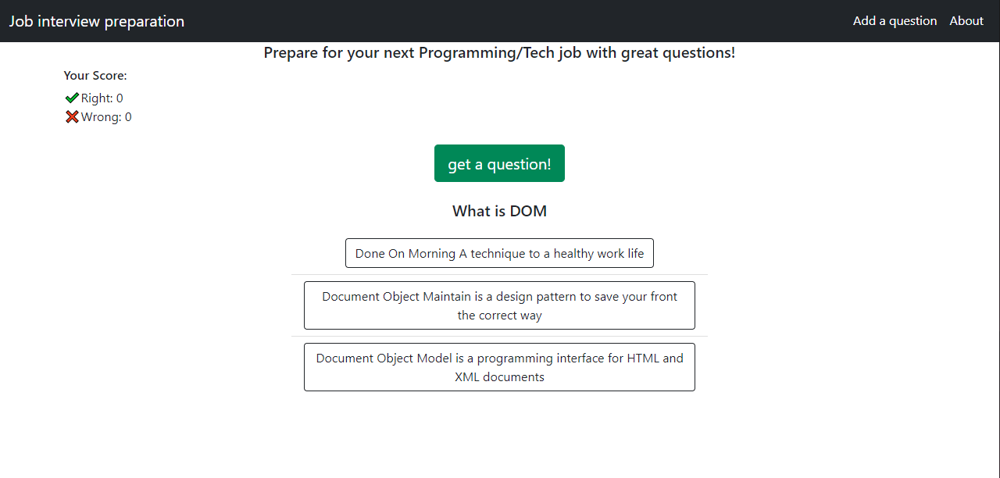

# Job interview preparation

In this project I made a website that shows random questions from a MongoDB database, and every one (even you😉) can support and upload new questions.

[Here's a link to the website](https://pure-shelf-42837.herokuapp.com/)

# Features

- 🔄 Get interesting random questions to prepare for a job interview
- 💯 Track how many answers you got right (or wrong...)
- 📩 Add more interesting questions, so everyone can learn!
- 😎 Responsive and mobile friendly design.

# Built with

- [🚩 NodeJS](https://nodejs.dev/)
- [🍃 MongoDB](https://www.mongodb.com/)
- [👢Bootstrap](https://getbootstrap.com/)
- [🕸 Webpack](https://webpack.js.org/)
- [🏁 Express](https://expressjs.com/)
